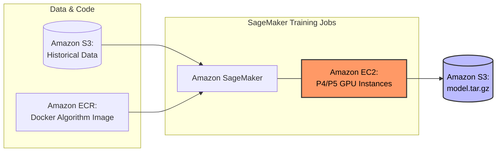
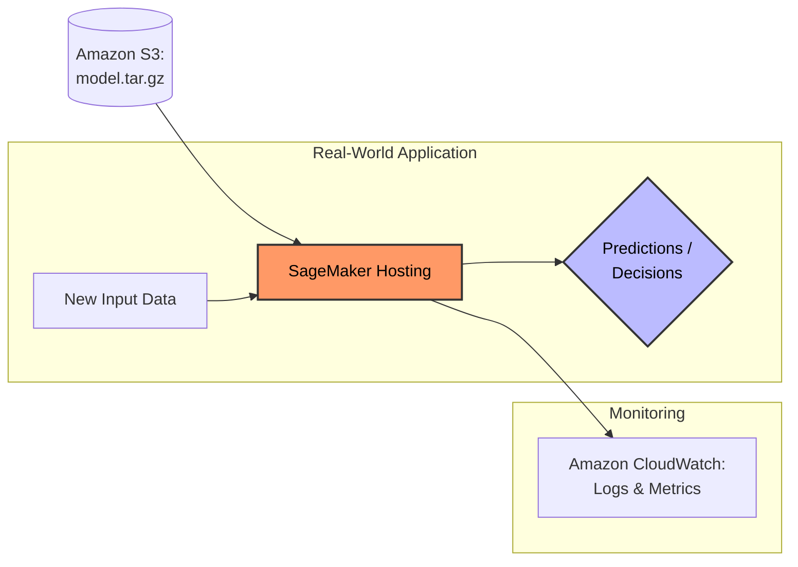

# Domain 1: Fundamentals of Machine Learning (ML) and Artificial Intelligence (AI)
# (1B: Basic AI Concepts and Terminology)

# High-Level Overview

# Deep Dive

## Model
### Explanation
  * **What is a** ***Model***?
    * A model in machine learning is akin to a *formula* or *recipe* that the computer uses to make **decisions** or **predictions**.
    * Models are built using historical data and learns patterns from that data.
    * The model then applies these learned patterns to new data.
    * Historical Data --> Computer --> Learned Patterns = Model (Formula/Recipe) --> Apply to new data --> Make decisions and/or predictions.
  * **Example:**
    * Spam Detection Systems: Model is trained from thousands of past emails marked as *spam* or *not spam*.
    * When a new email arrives, the Model predicts and decides if it's spam based on its training.

## Algorithm
### Explanation
  * **What is an** ***Algorithm***?
    * An algorithm is a ***set of instructions that creates the model*** by learning patterns in data.
    * The choice of algorithm affects how well the model performs.
    * Different algorithms produce different models.
    * Historical Data + Algorithm (Instructions) --> Computer --> Learned Patterns = Model (Formula/Recipe) --> Apply to new data --> Make decisions and/or predictions.
  * **Analogy:**
    * Think of an algorithm like a *cooking method*:
      * The algorithm is the *how-to* part.
      * Just like different cooking methods produce different results, different algorithms produce different models.
  * **Examples:**
    * A common algorithm is **Linear Regression**, which is used to predict outcomes like sales or pricing based on past data (re: drawing a line through the data).
    * Another algorithm is the **Decision Tree**, which breaks down decisions into a tree-like structure to help with classification (e.g., cats vs. dogs).
    * Linear Regression and Decision Tree algorithms are both **supervised learning** algorithms, where data is labeled before the model is trained.
    * An example of **unsupervised learning** is **Clustering** where similar (unlabeled) data points are *clustered* together based on their features.

## Training and Inference
### Explanation
  * **Training:**
    * Training is the process of feeding historical data into an algorithm to create a model.
  * **Inference:**
    * Inferencing is when the trained model is used to make predictions on new, unseen data.
    * Inferencing is using the model in the real world.
  * Training (Historical Data) --> Algorithm (Instructions) --> Computer --> Learned Patterns = Model (Formula/Recipe) --> Inferencing (Apply to New Data) --> Predictions/Decisions. 
  * **Analogy:**
    * *Training* is like a student studying for an exam using textbooks and practice problems.
    * *Inference* is like the student taking the exam and using what they learned to answer the questions.
  * **Examples:**
    * *Training:* Feeding the model thousands of customer purchase histories to help it learn what factors lead to a sale.
    * *Inference:* Using the trained model to predict if a new customer will make a purchase based on their browsing history.

## Mapping the Model to AWS
### Training  
  * Historical Data (CSV/JSON/Images) stored on Amazon S3 --> Fed into Algorithm (Instructions that "live" in a container image, so ECR) --> Computer (Amazon EC2 + Amazon SageMaker: SageMaker takes the S3 data and the dockerized algorithm from ECR and puts them together on an EC2 instance (specifically P4 or P5 instances)) = Model (saved in an S3 bucket as a model.tar.gz file)

### Inferencing
  * Model is deployed into the *real world* --> Applied to New Data (SageMaker Real-Time Endpoint or done severless via Amazon Bedrock) --> Model makes Predicitions/Decisions (these can be logged into CloudWatch)

## Fit
### Explanation
  * **What is** ***Fit***?
    * *Fit* describes how well a model **captures the patterns** in the training data.
    * A *good fit* means the model accurately learned from the data without too much error.
    * If the model *fits* the training data too closely, it might not work well on new data, which leads to either *overfitting* or *underfitting*.
  * **Overfitting:**
    * *Overfitting* occurs when the model **learns too many details** and **noise** from the training data, it performs poorly on new data.    
  * **Underfitting:**
    * *Underfitting* occurs when the model **doesn't learn enough** from the training data, missing important patterns.  
  * **Analogy:**
    * Like tailoring a suit; a good fit balances accuracy and flexibility. 
  * **Examples:**
    * A sales prediction model that perfectly matches past sales (overfit) might fail to predict future sales accurately because it learned too much from the specific past data.
    * A well-fitted model balances past accuracy and generalization for future data.  
