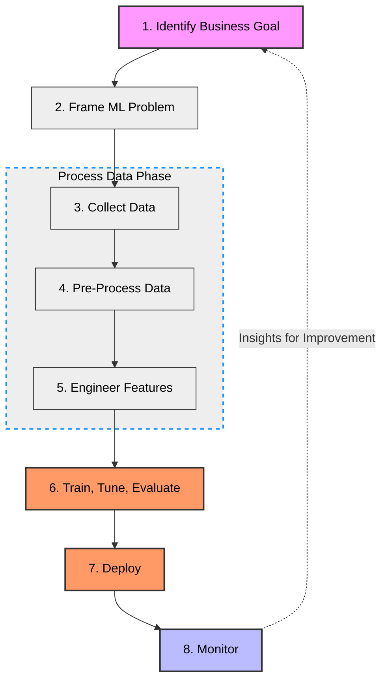
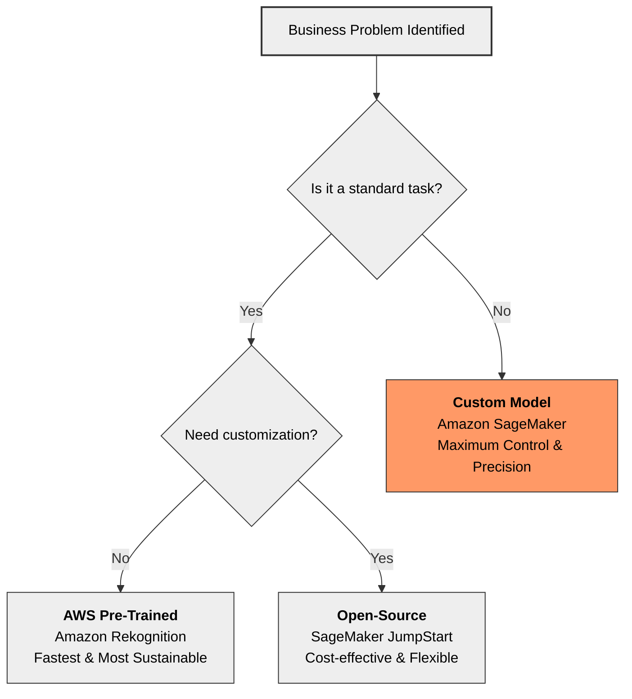
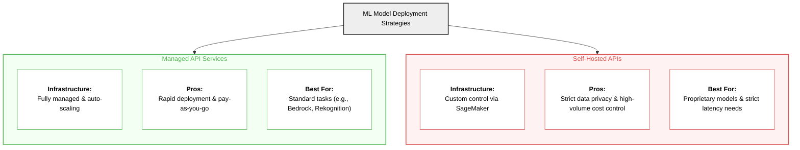
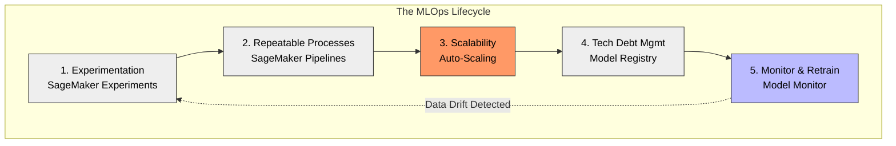

# Domain 1: Fundamentals of Machine Learning (ML) and Artificial Intelligence (AI)
# (1E: Machine Learning: Lifecycle, Sourcing Models, Deploying Models, and Operations)

# High-Level Overview
## Table 1: The 8-Step Machine Learning Lifecycle
| Step | Phase | Key Activities | AWS Service Spotlight |
| :--- | :--- | :--- | :--- |
| **1** | **Identify Goal** | Identify core problem and success criteria. | Business Analysis tools |
| **2** | **Frame Problem** | Define the ML problem and performance metrics. | **SageMaker Data Wrangler** (EDA) |
| **3** | **Collect Data** | Gather data from various sources. | **SageMaker Data Wrangler** |
| **4** | **Pre-Process** | Clean, transform, and format raw data. | **SageMaker Data Wrangler** |
| **5** | **Engineer Features** | Create and manage relevant variables. | **SageMaker Feature Store** |
| **6** | **Train & Tune** | Develop, fine-tune, and evaluate the model. | **Amazon SageMaker** |
| **7** | **Deploy** | Launch for real-time or batch predictions. | **SageMaker Serverless Inference** |
| **8** | **Monitor** | Track for performance anomalies and bias. | **SageMaker Model Monitor** |

## Machine Learning Lifecycle Visual Flow

---

## Table 2: AWS Service Quick Reference
| AWS Service | Lifecycle Stage(s) | Primary Purpose |
| :--- | :--- | :--- |
| **SageMaker Data Wrangler** | Framing, Collection, Pre-Processing, Feature Engineering | Exploration, cleaning, and transforming data. |
| **SageMaker Feature Store** | Feature Engineering | Centralized repository to store and manage features. |
| **Amazon SageMaker** | Training, Tuning, Evaluation, Deployment | General-purpose model development and hosting. |
| **SageMaker Model Monitor** | Monitoring | Tracking real-time performance, bias, and anomalies. |
| **Serverless Inference** | Deployment | Deploying models without managing infrastructure. |

---

## Table 3: Sources of ML Models
### This table breaks down the "Build vs. Buy" decision for AI.
| Model Source | Pros | Cons | Best Used For | AWS Examples |
| :--- | :--- | :--- | :--- | :--- |
| **AWS Pre-Trained** | Fully managed, fast deployment, highly sustainable. | Limited to built-in, generic use cases. | Quick solutions for common tasks (e.g., text translation). | Amazon Rekognition, Bedrock. |
| **Open-Source** | Cost-effective, customizable via fine-tuning. | Might not fit highly niche business needs. | Standard tasks needing minor custom tweaks. | SageMaker JumpStart (Hugging Face). |
| **Custom Models** | Highly flexible, full control over optimization. | High cost, time-consuming, requires ML expertise. | Unique, complex business problems. | Amazon SageMaker (End-to-End). |

## "Build vs. Buy" Decision Tree

---

## Table 4: Deploying ML Models
### This highlights the infrastructure trade-offs once a model is ready for the real world.
| Deployment Approach | Infrastructure | Key Advantages | Best Used For |
| :--- | :--- | :--- | :--- |
| **Managed API Services** | Fully managed by AWS; Auto-scaling included. | Rapid deployment, pay-as-you-go, built-in security. | Quick implementation of standard capabilities. |
| **Self-Hosted APIs** | Managed by you via SageMaker. | Maximum control, cost optimization for high-volume, data privacy. | Proprietary models with strict privacy/latency needs. |

## Deployment Visual Flow

---

## Table 5: Machine Learning Operations (MLOps)
### MLOps bridges the gap between creating a model and actually keeping it alive in production.
| MLOps Concept | Primary Goal | AWS Service |
| :--- | :--- | :--- |
| **Experimentation** | Test models/algorithms quickly to find the best fit. | SageMaker Experiments |
| **Repeatable Processes** | Ensure consistent training and evaluation. | SageMaker Pipelines |
| **Scalable Systems** | Handle varying workloads without performance loss. | SageMaker + Auto-Scaling |
| **Tech Debt Management** | Track version control to minimize manual interventions. | SageMaker Model Registry |
| **Model Monitoring** | Detect data drift and performance decay. | SageMaker Model Monitor |
| **Model Re-Training** | Update models with fresh data when performance degrades. | SageMaker Pipelines + Registry |

## MLOps Lifecycle Visual Flow

---

# Deep Dive

## Machine Learning Lifecycle                                            
### Step 1: Identify the Business Goal
  * Identify the *core business problem* and determine the *measureable objectives* and determine *success criteria*.

### Step 2: Frame the ML Problem
  * Define the *problem to be solved* using ML and identify *key performance metrics*.
  * **Amazon SageMaker Data Wrangler** is a service that can be used for *exploratory data analysis (visualizing relationships)* to frame the ML problem and determine the data characteristics.

### Step 3: Collect Data
  * Gather data from various sources to prepare for model training.
  * **Amazon SageMaker Data Wrangler** can also be used here for integrating and preparing data.

### Step 4: Pre-Process Data
  * *Cleanse*, *transform*, and *format the data* to make it suitable for training.
  * **Amazon SageMaker Data Wrangler** once again can help here for data preprocessing (including data cleaning, transformation, and feature selection).

### Step 5: Engineer Features
  * Create new features to *improve model performance*, selecting and extracting relevant variables.
  * **Amazon SageMaker Data Wrangler** facilitates the creation of new features.
  * **Amazon SageMaker Feature Store** provides a centralized repository to create, store, and manage features for use in both model training and real-time inference.

### Step 6: Train, Tune Evaluate
  * *Develop* and *fine-tune* the model using the training data and evaluate its performance.
  * **Amazon SageMaker** provides efficient training, tuning, and evaluation with a variety of algorithms.

### Step 7: Deploy
  * Deploy the model for *real-time* or *batch predictions* in a production environment.
  * **Amazon SageMaker** provides easy and scalable model deployment.

### Step 8: Monitor
  * Continuously *track model perfomrance* to maintain effectiveness.
  * **Amazon SageMaker Model Monitor** provides real-time tracking for anomalies, bias, etc.

## Summary of AWS Services (non-exhaustive list)
### Amazon SageMaker Data Wrangler:
  * Data Exploration
  * Data Pre-Processing (Clean, Transform, Format)
  * Feature Engineering
### Amazon SageMaker Feature Store:
  * Storing and managing features during Feature Engineering step.
### Amazon SageMaker:
  * Model Training
  * Tuning
  * Evaluation
  * Deployment
### Amazon SageMaker Model Monitor:
  * Continuous performance monitoring and maintenance.
### Amazon SageMaker Serverless Inference:
  * Purpose-built inference option that allows:
    * Deployment of ML models for inference.
    * Deployment without the need for configuring or managing the underlying infrastructure. 

## Sources of ML Models
### Overview of Model Options on AWS
#### AWS Pre-Trained Models:
* Managed services and models provided by AWS.
    * **Pros:**
        * Fully Managed: AWS handles the infrastructure, data processing, and scaling.
        * Fast Deployment: Ready to use via API, speeding up integration into business applications. 
    * **Cons:**
        * Limited to Built-In Use Cases: May not address highly specialized or unique business needs.
    * **When to Use:**
        * When you need a quick, managed solution for a common ML task (e.g., customer service bots, text translation).
        * When you want to optimize *cost* and *sustainability*, avoiding the overhead of training and maintaining custom models.   
    * **Examples:**
        * Amazon ReKognition
        * Amazon SageMaker Jumpstart
        * AWS Marketplace
#### Open-Source Pre-Trained Models:
* Models developed by open-source coummunities (e.g., TensorFlow, PyTorch) and fine-tuned on vast datasets.
    * **Pros:**
        * Quick and Cost-Effective: No need to gather large datasets or spend time on training.
        * Ideal for Common Use Cases: Great for standard tasks like text translation, image recognition, and sentiment analysis.
        * Customizable: Some can be fine-tuned with a smaller dataset to adapt to specific needs. 
    * **Cons:**
        * Limited Customization: They might not fit niche business needs perfectly and could require some trade-offs.
    * **When to Use:**
        * When you have a common problem type that aligns with available pre-trained models.
        * When you want to save costs and time by avoiding full-scale model training. 
    * **Examples on AWS:**
        * Accessed via Amazon SageMaker JumpStart: Hugging Face Models for NLP, image classification. 
#### Custom Models:
* Models built from scratch using unique data, tailored to the specific business use case.
    * **Pros:**
        * Highly Flexible: Can be tailored to address niche or complex business problems.
        * Full Control: Demands expertise in ML, data science, and model optimization.  
    * **Cons:**
        * Cost and Time: Requires significant time and resources for data collection, model training, and tuning.
        * Complexity: Demands expertise in ML, data science, and model optimization. 
    * **When to Use:**
        * When you have a unique business problem that pre-trained models cannot solve effectively.
        * When flexibility and custom performance are more important than cost and deployment speed. 
    * **How to Build on AWS:**
        * Use Amazon SageMaker for end-to-end model training, tuning, and deployment.  
### Trade-Off Analysis: Which Model to Use?
#### Considerations:
* **Cost:** Pre-trained models reduce costs as they skip the data collection and model training phases.
* **Time:** Using pre-trained models on AWS AI services accelerates development and deployment.
* **Performance:** Custom models can be optimized for specific business requirements, potentially outperforming generic pre-trained models.
* **Flexibility:** Custom models offer maximum flexibility for unique use cases, while pre-trained models come with limitations.
* **Sustainability:** Pre-trained models (open-source or AWS) are generally more sustainable, consuming fewer resources than training a model from scratch.
#### Decisions Guide:
* Use **Pre-Trained Models** (Open-Source or AWS) when:
    * Your use case aligns with common tasks (e.g., image classification, text translation).
    * Cost, time, and sustainability are critical factors.
* Opt for **Custom Models** when:
    * You need to address a specialized or complex problem that cannot be solved effectively with pre-trained models.
    * Your business requires complete control and optimization of the model.   

## Deploying ML Models
#### There are two (2) main approaches to deploying ML models in AWS:
 * Managed API Services
 * Self-Hosted APIs
### Managed API Services
#### Overview
 * These are fully managed services that provide **pre-trained** models through APIs.
 * Examples: Amazon Rekognition for image and video analysis (object detection, facial recognition) & Amazon Bedrock for NLP.
#### Advantages of using Managed API Services
 * **Easy Integration & Rapid Deployment**
   * You can quickly add AI capabilities to your app with minimal setup.
 * **Fully Managed Infrastructure**
   * You do not need to provision and manage servers, scale them, or update them - this is all managed by AWS.
 * **Auto-Scaling and High Availability**
   * Your infrastructure to run the AI solution will scale automatically and is architected to handle various workloads.
 * **Regular Updates**
   * You will receive access to the latest models and improvements without requiring additional work or effort.
 * **Pre-Trained Models**
   * You will have access to and utilize powerful pre-trained models for common AI tasks.
 * **Pay-as-you-Go Pricing**
   * No upfront costs and you will only pay for what you use.
 * **Built-In Security**
   * Compliance-ready security features like encryption is included with fully managed AI services.
 * **Use Cases**
   * Quick implementation for projects that require standard AI capabilities such as image analysis or text processing.
   * Scalable with your applications without the need for provisioning and managing the underlying infrastructure yourself.
   * Integration is seamless with other AWS services such as S3 for storage and Lambda for event-driven architectures and processing.
### Self-Hosted APIs
#### Overview
 * Self-hosted APIs for AI uses **Amazon SageMaker** to build, train, and deploy custom ML models on your infrastructure.
 * **Amazon SageMaker Jumpstart** is a feature within SageMaker (similar to DataWrangler) that offers pre-built models and solutions, which simplifies the process of self-hosting.
#### Advantages of using Self-Hosted APIs
 * **Customization and Control**
   * You can fine-tune the models you create along with the underlying infrastructure to meet specific needs.
 * **Model Flexibility**
   * You have the ability to choose and modify the ML frameworks and algorithms you're using to build your AI solution.
 * ** Cost Optimization**
   * By controlling resource allocation, you can potentially reduce costs associated with high-volume usage (re: setting limits, etc.).
 * **Enhanced Data Privacy**
   * You have greater control over sensitive data because you are self-hosting the API, making this solution ideal for projects with strict privacy requirements.
 * **Use Cases**
   * Need for suitable proprietary models that can be significantly customized.
   * Need for specific performance requirements, strict latency needs, or optimizations.
   * Need for full controls - the entire ML pipeline needs to be monitored and controlled by you.   
#### Features of Self-Hosted APIs
 * Support for various ML frameworks is available allowing you to leverage a wide range of frameworks to tailor to your specific use case.
 * You have flexibile deployment options since you are using SageMaker for real-time inference and/or batch processing.
 * Integrates with AWS services for monitoring, logging, and security (CloudWatch).

## Machine Learning Operations (MLOps)
### Overview
 * **Machine Learning Operations (MLOps)** is a set of practices designed to **streamline** and **automate** the *deployment*, *monitoring*, and *management* of ML models in production (live) environments.
 * **GOAL:** Accelerate the *deployment* of model, *maintain* model performance, and ensure *scalability* and *governance* throughout the ML lifecycle.
### Core Concepts
#### Experimentation
 * *Experimentation* is all about testing various models, algorithms (used to train models), and datasets (used to build algorithms) to find the best solution.
 * **MLOps Practices:**
   * Using tools like *Amazon SageMaker Experiments*, you can track experimentation by organizing your experiments and allowing collaboration during the experimentation phase.
   * *Fast iterations* where you build, train, and test models quickly and document the configurations and versions tested allow you to conduct more experiments and faster.
 * The benefits from experimentation is that they allow you to make informed decisions on which model to use, improves the selection of models you are building, and reduces redundancy through strong documentation of configuration and version control.
#### Repeatable Processes
 * Creating *repeatable processes* ensures **consistent training, evaluation** and **deployment** of ML models using the same methods every time and is key to:
   * Producing reliable results
   * Maintaining the model performance over time
 * **Amazon SageMaker Pipelines** is a service that automates an standardizes workflows for repeatability. 
#### Scalable Systems
 * **Scalability matters** because models must handle increasing data and user demands without losing performance! (always design for scale).
 * Leverage Amazon SageMaker and AWS Auto-Scaling to scale for large datasets and traffic and to adjust resources dynamically for varying workloads.
 * The benefits from using scalable systems is that they ensure your apps reliably perform while using resources in a cost-effective manner.
#### Managing Technical Debt
 * *Technical Debt* is the accumulation of shortcuts and unmanaged models that hinder future work.
 * **MLOps Practices:**
   * Using *SageMaker Model Registry* for managing model versions and even allowing you to promote specific models for deployment ensures an orderly management system for your ML models.
   * Documenting your *pipelines* well and automating them minimizes manual interventions and streamlines deployment and creates repeatable processes.
 * The benefits of managing technical debt is that it reduces maintenance time and heightens your ability to govern your models.
#### Model Monitoring
 * *Model Monitoring* is critical because models will drift or decay in performance over time.
 * By monitoring your model(s), you will detect changes in performance due to data drift, model decay, and/or shifts in user behavior.
 * Leveraging *Amazon SageMaker Model Monitor* allows you to monitor your models in real-time and provides alerts when anomalies are detected.
 * The benefits of using monitoring is that it maintains *accuracy* of your models and enhances trust and reliability in the predictions/decisions your models make.
#### Model Re-Training
 * Models need to be re-trained when they experience degradation due to changes in input data or problem domains, such as shifts in user behavior and changes to input data.
 * Leveraging *Amazon SageMaker Pipelines* can automate re-training your model with fresh data.
 * Building and using a Model Registry will ensure only the best and most current models are deployed into production.

