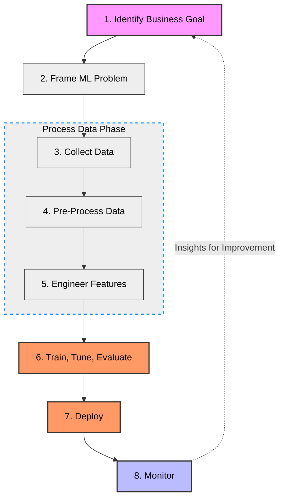

# Domain 1: Fundamentals of Machine Learning (ML) and Artificial Intelligence (AI)
# (1E: Machine Learning: Lifecycle, Sourcing Models, Deploying Models, and Operations)

# High-Level Overview
## Table 1: The 8-Step Machine Learning Lifecycle
| Step | Phase | Key Activities | AWS Service Spotlight |
| :--- | :--- | :--- | :--- |
| **1** | **Identify Goal** | Identify core problem and success criteria. | Business Analysis tools |
| **2** | **Frame Problem** | Define the ML problem and performance metrics. | **SageMaker Data Wrangler** (EDA) |
| **3** | **Collect Data** | Gather data from various sources. | **SageMaker Data Wrangler** |
| **4** | **Pre-Process** | Clean, transform, and format raw data. | **SageMaker Data Wrangler** |
| **5** | **Engineer Features** | Create and manage relevant variables. | **SageMaker Feature Store** |
| **6** | **Train & Tune** | Develop, fine-tune, and evaluate the model. | **Amazon SageMaker** |
| **7** | **Deploy** | Launch for real-time or batch predictions. | **SageMaker Serverless Inference** |
| **8** | **Monitor** | Track for performance anomalies and bias. | **SageMaker Model Monitor** |

---

## Table 2: AWS Service Quick Reference
| AWS Service | Lifecycle Stage(s) | Primary Purpose |
| :--- | :--- | :--- |
| **SageMaker Data Wrangler** | Framing, Collection, Pre-Processing, Feature Engineering | Exploration, cleaning, and transforming data. |
| **SageMaker Feature Store** | Feature Engineering | Centralized repository to store and manage features. |
| **Amazon SageMaker** | Training, Tuning, Evaluation, Deployment | General-purpose model development and hosting. |
| **SageMaker Model Monitor** | Monitoring | Tracking real-time performance, bias, and anomalies. |
| **Serverless Inference** | Deployment | Deploying models without managing infrastructure. |

---

# Deep Dive

## Machine Learning Lifecycle                                            
### Step 1: Identify the Business Goal
  * Identify the *core business problem* and determine the *measureable objectives* and determine *success criteria*.

### Step 2: Frame the ML Problem
  * Define the *problem to be solved* using ML and identify *key performance metrics*.
  * **Amazon SageMaker Data Wrangler** is a service that can be used for *exploratory data analysis (visualizing relationships)* to frame the ML problem and determine the data characteristics.

### Step 3: Collect Data
  * Gather data from various sources to prepare for model training.
  * **Amazon SageMaker Data Wrangler** can also be used here for integrating and preparing data.

### Step 4: Pre-Process Data
  * *Cleanse*, *transform*, and *format the data* to make it suitable for training.
  * **Amazon SageMaker Data Wrangler** once again can help here for data preprocessing (including data cleaning, transformation, and feature selection).

### Step 5: Engineer Features
  * Create new features to *improve model performance*, selecting and extracting relevant variables.
  * **Amazon SageMaker Data Wrangler** facilitates the creation of new features.
  * **Amazon SageMaker Feature Store** provides a centralized repository to create, store, and manage features for use in both model training and real-time inference.

### Step 6: Train, Tune Evaluate
  * *Develop* and *fine-tune* the model using the training data and evaluate its performance.
  * **Amazon SageMaker** provides efficient training, tuning, and evaluation with a variety of algorithms.

### Step 7: Deploy
  * Deploy the model for *real-time* or *batch predictions* in a production environment.
  * **Amazon SageMaker** provides easy and scalable model deployment.

### Step 8: Monitor
  * Continuously *track model perfomrance* to maintain effectiveness.
  * **Amazon SageMaker Model Monitor** provides real-time tracking for anomalies, bias, etc.
### Visual Flow

## Summary of AWS Services (non-exhaustive list)
### Amazon SageMaker Data Wrangler:
  * Data Exploration
  * Data Pre-Processing (Clean, Transform, Format)
  * Feature Engineering
### Amazon SageMaker Feature Store:
  * Storing and managing features during Feature Engineering step.
### Amazon SageMaker:
  * Model Training
  * Tuning
  * Evaluation
  * Deployment
### Amazon SageMaker Model Monitor:
  * Continuous performance monitoring and maintenance.
### Amazon SageMaker Serverless Inference:
  * Purpose-built inference option that allows:
    * Deployment of ML models for inference.
    * Deployment without the need for configuring or managing the underlying infrastructure. 

## Sources of ML Models
### Overview of Model Options on AWS
#### AWS Pre-Trained Models:
* Managed services and models provided by AWS.
    * **Pros:**
        * Fully Managed: AWS handles the infrastructure, data processing, and scaling.
        * Fast Deployment: Ready to use via API, speeding up integration into business applications. 
    * **Cons:**
        * Limited to Built-In Use Cases: May not address highly specialized or unique business needs.
    * **When to Use:**
        * When you need a quick, managed solution for a common ML task (e.g., customer service bots, text translation).
        * When you want to optimize *cost* and *sustainability*, avoiding the overhead of training and maintaining custom models.   
    * **Examples:**
        * Amazon ReKognition
        * Amazon SageMaker Jumpstart
        * AWS Marketplace
#### Open-Source Pre-Trained Models:
* Models developed by open-source coummunities (e.g., TensorFlow, PyTorch) and fine-tuned on vast datasets.
    * **Pros:**
        * Quick and Cost-Effective: No need to gather large datasets or spend time on training.
        * Ideal for Common Use Cases: Great for standard tasks like text translation, image recognition, and sentiment analysis.
        * Customizable: Some can be fine-tuned with a smaller dataset to adapt to specific needs. 
    * **Cons:**
        * Limited Customization: They might not fit niche business needs perfectly and could require some trade-offs.
    * **When to Use:**
        * When you have a common problem type that aligns with available pre-trained models.
        * When you want to save costs and time by avoiding full-scale model training. 
    * **Examples on AWS:**
        * Accessed via Amazon SageMaker JumpStart: Hugging Face Models for NLP, image classification. 
#### Custom Models:
* Models built from scratch using unique data, tailored to the specific business use case.
    * **Pros:**
        * Highly Flexible: Can be tailored to address niche or complex business problems.
        * Full Control: Demands expertise in ML, data science, and model optimization.  
    * **Cons:**
        * Cost and Time: Requires significant time and resources for data collection, model training, and tuning.
        * Complexity: Demands expertise in ML, data science, and model optimization. 
    * **When to Use:**
        * When you have a unique business problem that pre-trained models cannot solve effectively.
        * When flexibility and custom performance are more important than cost and deployment speed. 
    * **How to Build on AWS:**
        * Use Amazon SageMaker for end-to-end model training, tuning, and deployment.  
### Trade-Off Analysis: Which Model to Use?
#### Considerations:
* **Cost:** Pre-trained models reduce costs as they skip the data collection and model training phases.
* **Time:** Using pre-trained models on AWS AI services accelerates development and deployment.
* **Performance:** Custom models can be optimized for specific business requirements, potentially outperforming generic pre-trained models.
* **Flexibility:** Custom models offer maximum flexibility for unique use cases, while pre-trained models come with limitations.
* **Sustainability:** Pre-trained models (open-source or AWS) are generally more sustainable, consuming fewer resources than training a model from scratch.
#### Decisions Guide:
* Use **Pre-Trained Models** (Open-Source or AWS) when:
    * Your use case aligns with common tasks (e.g., image classification, text translation).
    * Cost, time, and sustainability are critical factors.
* Opt for **Custom Models** when:
    * You need to address a specialized or complex problem that cannot be solved effectively with pre-trained models.
    * Your business requires complete control and optimization of the model.   

## Deploying ML Models

