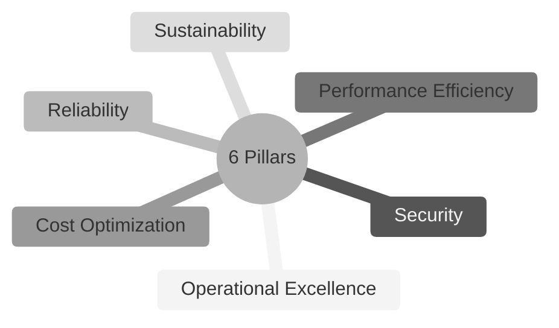

# Domain 1: Cloud Concepts
# (1B: The Well-Architected Framework)

## The Six (6) Pillars of the AWS Well-Architected Framework (Design Framework)

1. **Operational Excellence**
   * Running and Monitoring Systems
   * Constant Improvement

2. **Security**
   * Protecting Information, Data, and Assets

3. **Reliability**
   * Recover from Failures
   * Meet Demand

4. **Performance Efficiency**
   * Speed
   * Effective Use of Resources as Demand Fluctuates

5. **Cost Optimization**
   * Avoid Unnecessary Costs
  
6. **Sustainability**
   * Minimize Environmental Impact (newest pillar)
  
**Remember: C.O.R.P.S.S.**
   * Cost Optimization
   * Operational Excellence
   * Reliability
   * Performance Efficiency
   * Security
   * Sustainability

